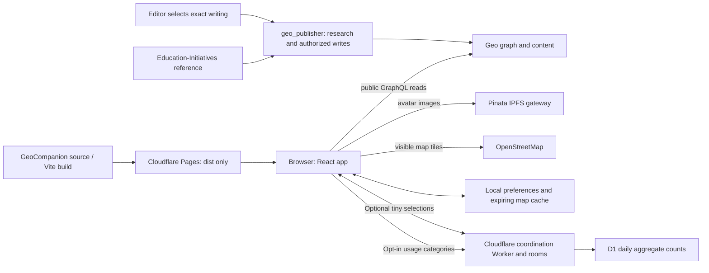

# How Geo Companion works

Current implementation: [graph explorers](docs/GRAPH_EXPLORERS.md). Version 0.5.0 adds [larger networks and opt-in persistent cache jobs](docs/GRAPH_CACHE_DESIGN.md); that contract supersedes the historical memory-only cache and graph-size descriptions below. React Flow is the default; force-graph is an optional lazy-loaded pop-out.

This document describes the implemented system. Proposed infrastructure is explicitly separated below. Feature-specific documents contain the exact query contracts.

This describes current source, not an automatic deployment of every committed change. Start with the [README teaching tour](README.md#a-tour-from-publication-to-pixels) for query and transformation examples. [DEPLOYMENT.md](DEPLOYMENT.md) records the actual hosted release.

The [living Geo design](docs/LIVING_GEO_DESIGN.md) is partially implemented. Native Questions, ordered dataset catalog/result reads, dynamic relationship filters and membership-aware references are in the current source. The September 12 browser check observed 27 catalog entries and all 21 original Questions. Older per-feature readers, block capability handling, broader comparisons and complete outreach scheduling remain unfinished; see the [README gap assessment](README.md#weaknesses-and-planned-improvements).

## Runtime and ownership

The optional Cloudflare coordination backend handles two-person selections and opt-in aggregate usage counts; it does not fetch Geo content or hold a wallet. Linux-cloud is not involved. See [coordination design and limits](docs/COORDINATION.md). Geo reads use `https://api-testnet.geobrowser.io/graphql`. This is testnet, not an implied production-network integration. Frontend bundles contain public space/property IDs, never wallet or Cloudflare secrets.

## Startup and navigation

1. `index.html` loads [main.tsx](src/main.tsx), which mounts React, the shared preferences provider and the optional shared-exploration controls. The public coordination endpoint comes from `/coordination.json`.
2. [App.tsx](src/app/App.tsx) reads the hash through [routes.mjs](src/app/routes.mjs). Root shows the selector; education and outreach modules are lazy imports. Unknown routes show a missing-page screen. Legacy education fragments remain supported.
3. The selected app owns its navigation and transient state. Switching apps unmounts the previous app. Shared preferences survive via the provider and local storage.
4. [Brand.tsx](src/shared/branding/Brand.tsx) supplies the same triangle everywhere. Selector icons read the primary space's scoped Avatar relation and image IPFS URL. Missing or failed images fall back to the triangle; a cover is not silently substituted.

The two available apps are intentionally registered in the shell. Their space avatars are dynamic. This is separate from the Connections view's dynamically discovered space list.

## Feature-to-data contracts

| Screen / component | Adapter | Operation and boundary |
| --- | --- | --- |
| DatasetExplorer | [dataset-data.mjs](src/apps/education/dataset-data.mjs) | Native ordered catalog and result collection reads; typed fields, methods blocks and compatible grade/arm plot |
| Curation | [curation-live.mjs](src/apps/education/curation-live.mjs) | Discover profile Posts, fetch selected post, read scoped Blocks and references, order positions lexicographically; resolve reference destinations through actual space membership |
| DebateBoard | [argument-data.mjs](src/apps/education/argument-data.mjs), [debates.mjs](src/apps/education/debates.mjs) | Scoped non-factual Claim discovery and on-demand argument neighborhoods; Public responses uses classified Claim pagination and separate response counts, without title-keyword/tag discovery. See [dynamic contract](docs/DYNAMIC_ARGUMENTS.md) |
| ConnectionExplorer | [connection-data.mjs](src/apps/education/connection-data.mjs) | Follow selected relation kinds from education/profile roots; group shared targets, preserve distinct source records, resolve actual space names |
| LocationMap | [location-data.mjs](src/apps/education/location-data.mjs) | Page education location edges, deduplicate places, query Places-scoped coordinates, reject invalid/conflicting points |
| Evidence atlas | [atlas-live.mjs](src/apps/education/atlas-live.mjs), [LiveAtlas.tsx](src/apps/education/LiveAtlas.tsx) | Scoped program/study reads and linked Claims; no bundled snapshot |
| Questions | [question-data.mjs](src/apps/education/question-data.mjs), [Questions.tsx](src/apps/education/Questions.tsx) | Native ordered Question collection and actual Answer targets; shared reader, separate from Claim debates |
| Preferences and follows | [profile-search.mjs](src/shared/preferences/profile-search.mjs) | Name/ID queries narrow on input; verify personal spaces; save chosen IDs rather than a hardcoded identity list |
| Selector icons | [space-icons.mjs](src/shared/branding/space-icons.mjs) | Space-scoped Avatar and IPFS URL lookup; only immutable CID image URLs accepted |
| OutreachMap | [OutreachMap.tsx](src/apps/outreach/OutreachMap.tsx) | Lazy Leaflet map of typed public stops from the scoped live directory; see [adapter contract](docs/OUTREACH_LIVE.md) |

Query text, schema IDs and parsing rules stay with the feature adapter because these contracts differ. Presentation components handle selection, loading, errors and rendering. Tests exercise malformed data, scoping-related transforms, pagination and cache behavior rather than duplicating screen copy.

## Caching and network flow

| Data | Cache / retention | Refresh behavior |
| --- | --- | --- |
| Dataset/Question reads and shared references | Shared memory reader, 2 minutes, 128 entries and estimated 4 MiB serialized values; 4 concurrent requests | Explicit invalidation and generation guards; dashboard/Questions use the shared reader |
| Public response counts | Feature memory, 1 minute | Explicit refresh; no claim of instant updates |
| Research questions and argument pages | Shared module memory, 5 minutes, 64 parsed pages; identical in-flight reads shared | On demand only; Refresh clears pages; no persistent content cache |
| Profile search | Memory, 5 minutes, at most 50 query entries | Debounced input and abortable requests |
| Curation reads | Memory, 5 minutes, at most 30 query entries | Explicit refresh bypasses cache |
| Connections | Memory, 5 minutes, at most 40 query entries | Bounded cursor batches and explicit load more |
| Space icons | Memory, 5 minutes | Revisit after expiry; browser caches immutable image bytes |
| Education locations | Local storage, fresh for 1 hour, retained up to 7 days | Refresh on stale load; prior results can remain visible on failure |
| Preferences and local drafts | Local storage until changed/cleared | No automatic publication or server synchronization |
| Map tiles and static assets | Normal HTTP caching | Only visible tiles; no offline tile prefetch |

No background polling or VM proxy is added by these components. Cache policies are currently feature-specific, not one universal cache. Canonical profile writing is not bundled or persisted as a silent fallback. The map cache is public derived data, distinct from saved user preferences.

## Appearance

Shared `theme.css` defines semantic light/dark palettes using the system preference; `mobile.css` supplies common mobile controls and layout rules. Native color-scheme support, chart colors and map-control overrides avoid per-app theme drift. No appearance API requests or stored theme override. See [appearance/accessibility](docs/APPEARANCE_ACCESSIBILITY.md).

## Rendering and safety

Remote data is untrusted. Curation uses React Markdown with HTML skipped; links are restricted to HTTP(S), and inline content images are links rather than automatic large downloads. Map labels use text nodes. Invalid or incomplete graph responses yield explicit errors or missing-data states. Unknown values are not converted into zero or false. Source details and limitations belong where they affect interpretation; infrastructure diagnostics stay out of visitor copy.

`public/_headers` restricts script, connection and image origins. Content APIs go to Geo; optional coordination uses the explicitly allowed Cloudflare Worker HTTPS/WebSocket origin. Map images go to OSM and avatars to the selected IPFS gateway. Required map attribution remains visible. Adding a provider requires reviewing both code and CSP.

## Publisher integration

[geo_publisher](https://github.com/athsrueas-geocurator/geo_publisher) owns research, mapping, deduplication, authorization and transaction verification. GeoCompanion owns read adapters, presentation and frontend deployment. See [PUBLISHER_HANDOFF.md](PUBLISHER_HANDOFF.md) and the publisher's [dashboard contract](https://github.com/athsrueas-geocurator/geo_publisher/blob/main/docs/education-dashboard-data-contract.md).

Publication flow: agree on dataset membership and existing ontology → publisher prepares and verifies authorized writes → inspect real API responses → implement bounded adapter and meaningful tests → render loading/empty/error states → verify browser destinations and deploy. New content matching an existing contract should appear through refresh/discovery without a frontend release; a new schema or application tool still requires code changes.

Outreach belongs in the user-approved Public good space, but space membership alone is insufficient. The outreach reader constrains exact directory dataset membership, service/program/location identity and public-location status. Do not expose private encampments, infer opening hours or label stale schedules as available today. See [outreach specification](https://github.com/athsrueas-geocurator/geo_publisher/blob/main/docs/indianapolis-outreach-directory.md).

## Deployment and planned infrastructure

`npm run build` produces static `dist/`. `scripts/deploy.mjs` explicitly reads only Cloudflare deployment values from the local `.env`, checks the output, and uploads `dist/` to the existing Pages project. GitHub is source control; a Git push is not a verified Pages deployment. See [DEPLOYMENT.md](DEPLOYMENT.md).

`linux-cloud` is not serving app requests, scheduled aggregates or public forwarding for this implementation. A conservative ongoing collector is proposed in [LOW_EGRESS_PROTOCOL.md](LOW_EGRESS_PROTOCOL.md), not deployed as an app dependency. A separate bounded metadata-upload experiment exists in Open_Data; see DEPLOYMENT.md for that distinction. There is no guaranteed zero-cost claim, spending cap or operational service implied by that design.

## Shared point maps

Education LocationMap and outreach OutreachMap adapt their validated records into `MapCanvas` point layers. The component retains one Leaflet instance, replaces visible groups without refitting after every update, and provides common selection/layer controls. Search remains app-owned. Geo fetches and privacy checks stay in the existing adapters. See [map roadmap](docs/MAP_LAYERS_PLAN.md).
