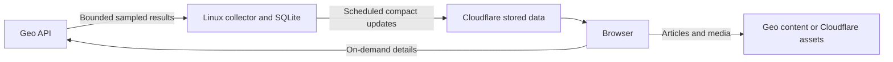

# Geo Companion low-egress protocol

Design proposal, September 11, 2026. None of the collector, limits or synchronization behavior below is implemented. Current production uses Pages and direct browser Geo queries. This replaces the optional VM forwarding experiment as the intended next architecture.

## Objective

VM outbound traffic must depend on a bounded publication schedule, not visitor count. Geo remains canonical; Cloudflare distributes the app and derived data. Linux computes compact history and indexes in a rebuildable SQLite database. Published editorial material remains in the user's Geo profile.

No public application listener on Linux: no visitor manifests, redirects, WebSockets, arbitrary proxy, media hosting, TURN relay or IPFS seeding. Cloudflare cache misses reach Cloudflare storage, never Linux. Published data survives the VM stopping. Requests, acknowledgements for inbound data, TLS, DNS, retries, SSH and OS maintenance all count toward host traffic; downloading is not zero-egress activity.

## Protocol v1: partition replacement over HTTPS

Use deterministic UTF-8 JSON, stable Geo IDs and SHA-256. Do not choose a binary transport until measurements justify it.

| Resource | Contract |
| --- | --- |
| `/data/v1/current.json` | Mutable pointer, at most 4 KiB decoded. Protocol version, increasing generation, checkedAt, observedAt, publishedAt, coverage status and index reference. |
| `/data/v1/objects/<sha256>.json` | Immutable index or data partition, at most 64 KiB decoded. References carry path, hash and decoded length. |
| Claim samples | Entity ID, space ID, vote kind, observation time and counts. Keep curation, stance and veracity separate; large integers use decimal strings. |
| Content references | Geo entity/space IDs and source URLs; articles, images and PDFs are fetched directly on demand. |

Partition by topic and fixed ID-prefix bucket; split oversized buckets by a further prefix byte. Bound index fan-out rather than accumulating all history hashes in the root. Hash exact deterministic JSON bytes before transport compression; browser checks decoded bytes. Fix serializer, field ordering and schema version in implementation. An HTTP ETag is not assumed to equal our SHA-256.

Hashes detect corruption, not replacement by a malicious publisher. V1 trusts HTTPS origin and restricted publisher credentials. Signed manifests and key rotation are a future requirement for untrusted mirrors.

## Collection and publication

1. Single-writer lock and durable byte reservation before network activity. Restarting cannot reset counters or advance a cursor.
2. Fixed allowlisted queries to verified `https://api-testnet.geobrowser.io/graphql`. Change cursors, conditional POST support and global rate limits are unverified: do not invent them. Start with bounded snapshots of a documented scope.
3. Bound requests, pages, time and compressed/decoded input. A truncated or failed scan means partial/unavailable, not zero. Never infer deletion from absence in a partial scan.
4. Save samples transactionally. Differences are changes between observations, not every vote event. Retractions/index corrections can reduce counts. Do not infer unique voters or attention from vote totals.
5. Serialize partitions locally; upload only changed/missing hashes. Timestamp-only changes must not rewrite all partitions. Coalesce liveness into the publication schedule.
6. Verify objects, then publish the root pointer last. Keep the previous complete generation until success. Single publisher only; multiple writers would need tested conditional writes/coordination.
7. On an uncertain result, read remote generation/hash before retrying. Bounded backoff with jitter and Retry-After support. Retries share the original reservation, never a new unlimited allowance.

## Browser synchronization

- Fetch pointer on first visit; recheck at most once per 15 minutes while visible. Pause hidden tabs, respect data-saving preferences and share checks across tabs where supported. These are optimizations, not security controls.
- Pointer cache target: `public, max-age=60, s-maxage=900`; ETag plus If-None-Match/304 where supported. Immutable objects: `public, max-age=31536000, immutable`. Verify actual deployed headers, encoding negotiation and Vary behavior.
- Compare partition hashes and download only visible-page objects absent from IndexedDB. Storage eviction is a normal cold-start case.
- Validate decoded length, schema and hash before atomically showing new data. Interrupted download or wrong hash leaves the previous complete generation visible.
- Display source observation and last successful collection separately. Proposed stale threshold: 12 hours for a six-hour collection cadence. Explicit refresh queries bounded details directly from Geo and labels their freshness separately.

304 responses save bodies but still consume requests and headers. Fresh caches avoid even that exchange. Neither should contact the VM.

## Optional v2 deltas

Start with partition replacement. Add deltas only when compressed patch plus request overhead is less than half the full replacement cost. Contract: baseHash, targetHash, version/sequence, ID-keyed upserts and explicit tombstones. Apply transactionally and verify reconstructed target hash.

Maximum one delta from a checkpoint; a missing base or bad patch triggers one bounded full-object fetch from Cloudflare. No unbounded patch chains. These are custom application messages over HTTPS, not an assumed upstream delta protocol.

CBOR, dictionaries, Merkle trees, Bloom filters and WebRTC remain deferred until byte measurements support them. Browser P2P introduces peer availability, privacy and relay concerns. IPFS references require available providers/pinning; Linux must not become the content distributor.

## Proposed budgets and enforcement

| Control | Initial bound |
| --- | --- |
| Scheduled jobs | 4/day, one concurrent job |
| Public output body | 128 KiB/run total, including pointer and partitions |
| Upstream requests | 10 attempts/run including retries |
| Upstream decoded input | 2 MiB/run; mark partial at limit |
| Time | 30 seconds/request; 5 minutes/run |
| App outbound reservation | 256 KiB/run including query/upload/control overhead estimates |
| App monthly envelope | 40 MiB, durable accounting |
| Whole-host target | 100 MiB/month; pause app at 80 MiB observed host transmit |

For a 31-day month: 4 × 31 × 256 KiB = 31 MiB, leaving 9 MiB inside the app envelope. These are design targets, not measured results. Reserve the whole transaction including retries; skip publication if it cannot fit. No automatic backlog replay or budget increases. Visitor count must not appear in the VM byte equation.

Host interface counters include all traffic, not precisely Google's billable bytes. Persist across restarts and detect resets; missing accounting pauses jobs until reconciled. The remaining host allowance is for administration. SSH and OS updates can exceed it, so this is not a hard host-wide/billing cap. A true network cutoff requires a separately tested policy and recovery path; do not lock out SSH or disable updates as part of this proposal.

## Cloudflare storage decision

Measure the existing Pages Direct Upload path first. At most four scheduled data publications/day; build frontend off-VM. Do not retransmit the whole frontend every run. Verify deduplication and all deployment overhead before accepting this path. Include old referenced objects in future deployments. The published hosted-build quota is not proof of Direct Upload/API limits; check those separately. If publication cannot fit the reservation, stop and select independent object storage.

Preferred independent-data candidate: R2 Standard with public custom-domain reads, immutable objects and a small pointer; no VM origin or per-visitor Worker required. R2 storage and operations have separate allowances and no assumed spending cap. Verify account terms, read/write counts, public access, caching, CORS and bucket-restricted credentials before provisioning. Existing Pages/DNS credentials do not establish R2 access. No R2 enrollment or bucket is created by this document.

Keep 30 days of complete generations within a separate storage bound. Older clients fall back to the latest checkpoint. Compact daily history has its own retention policy. Garbage collection never removes an object referenced by a retained generation. Preserve a known-good rollback deployment/pointer. Private credentials and editorial drafts never enter public objects.

## Acceptance before deployment

1. Validate real Geo samples, provenance and scope against GEO.md/DEBATES.md; document unresolved upstream limits.
2. Replay unchanged data, a single-count change, mass change, retraction, partial scan and schema change. Prove deterministic output and safe deletions.
3. Inject failed upload, stale pointer, missing/corrupt object, rate limiting and restart. Preserve old data and bounded recovery.
4. Measure cold/warm publisher traffic including control overhead. Run 1,000 simulated clients: zero application requests reach Linux, and no extra collection occurs.
5. Exhaust byte allowance and reset counters in a controlled test: jobs pause, site stays readable, administration remains possible.
6. Verify CORS, cache headers, size/hash checks, stale UI and browser destinations on both site domains.
7. Measure seven days of app bytes, whole-host transmit, API attempts, storage operations and freshness before committing production cadence.

## Sources

- [HTTP semantics](https://www.rfc-editor.org/rfc/rfc9110.html): conditional requests, validators and content encoding.
- [HTTP caching](https://www.rfc-editor.org/rfc/rfc9111.html).
- [Pages limits](https://developers.cloudflare.com/pages/platform/limits/).
- [R2 pricing](https://developers.cloudflare.com/r2/pricing/): verify separately before provisioning.
- Local integration evidence: GEO.md and DEBATES.md. Account observations: BILLING.md.
