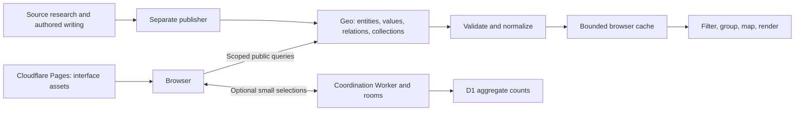

# Geo Companion

A lightweight, read-only companion to Geo, with separate education and Indianapolis outreach apps.

## Why I built it this way

I wanted to see how much I could build without creating another monthly bill. Free was the goal, but so were efficiency and accessibility. It should work in an ordinary browser, including on a phone, without someone needing a wallet or an account just to explore. I wanted to be thoughtful about what gets downloaded, what can be cached, and whether a server needs to be involved at all. Having access to a Linux box doesn't mean every request should pass through it.

I also wanted to make something useful alongside Geo while keeping Geo at the center. The data, relationships, and my published writing belong there, where other people can explore them and build something else with them. This app should help people do things with that information: compare educational findings, follow a connection between a book and an idea, or eventually find out where someone can get help in Indianapolis. I want new information published on Geo to become useful here without having to rewrite the app every time.

As a teacher, I spent a lot of time putting numbers on students when I would rather have been learning with them. That experience matters to how I think about this project. A dashboard needs to help us ask a better question or make a useful decision. Displaying more numbers isn't the goal. I'm interested in real levers for improving education when resources are scarce, and in helping outreach organizations coordinate around what people actually need.

This is also an experiment in what an agent can help one person orchestrate. There is research, data organization, publishing, interface design, hosting, and all the work of getting those pieces to agree with one another. I wanted to see how far I could take an idea by working through those connections with an agent. My role is still to decide what matters, question the results, and write and curate my own thoughts. The technology should give me more room to do that thoughtfully.

[Open the app](https://geocompanion.dpdns.org/) · [Architecture](ARCHITECTURE.md) · [Development](docs/DEVELOPMENT.md) · [Deployment record](DEPLOYMENT.md) · [Unfinished work](TODO.md)

## What this project teaches

Build a small interface around a living knowledge graph: keep canonical content and relationships in Geo, fetch bounded slices in the browser, and derive useful views locally. Deploy interface changes when application behavior changes; ordinary edits to supported data should appear after refresh without a rebuild.

**This README describes source on `main`, reviewed September 12, 2026. It is not a claim that every change is deployed.** The latest verified Pages release is `7889e066`, built from `ef778c4`, including collection, reference, filtering and block-capability improvements. See [Deployment](DEPLOYMENT.md) for verified hosting observations. The endpoint currently used is Geo **testnet**.

| Feature | Current source behavior | Important boundary |
| --- | --- | --- |
| Education dashboards | Ordered Geo catalog → datasets → result collections; methods text, typed fields and relationship filters | 27 catalog entries observed, not 27 independently implemented chart types |
| Quantitative plot | Compatible grade/arm percentile-point estimates, with live labels and calculated uncertainty intervals | No general cross-study ranking or affordability calculation |
| Evidence atlas | Live program/study discovery and linked findings | Scope and source coverage are bounded; not a complete census of educational evidence |
| Questions | Native Question collection; original 21 records and actual Answer relationships | Missing Answers stay missing; Claims are a different model |
| Curation | Profile Post discovery, ordered text and membership-aware references | User-authored content stays on Geo; selected Post ID may be saved locally |
| Arguments and public responses | Explicit argument relationships; separately fetched response counts | Connections or popularity do not prove a claim |
| Connections and education map | Shared linked entities and public coordinates from Geo | Education/profile roots and supported relation kinds limit discovery |
| Indianapolis outreach | Separate shell and lazy basemap | No published directory contract ready for operational reads or service pins |
| Preferences and optional shared exploration | Local preferences/followed IDs; explicit two-person selection messages and opt-in coarse counts | Following is not login; shared exploration is a bounded prototype |

## A tour from publication to pixels



The Google VM is not in this application request path. Public Geo reads need no frontend wallet. Maps request visible OpenStreetMap tiles directly; avatars use an approved IPFS gateway. Optional coordination carries selections and counts, not copies of Geo content.

### 1. Keep application rules in code; keep membership in the graph

[App.tsx](src/app/App.tsx) registers the two executable apps and lazy-loads them. [routes.mjs](src/app/routes.mjs) validates navigation. Routes, UI controls, security policy and supported ontology meanings are code. A graph entity cannot inject a new executable component.

[geo.mjs](src/config/geo.mjs) supplies trusted bootstrap IDs. One catalog ID replaces a growing list of individual dataset IDs. The dashboard follows this shape:

```text
Known catalog block --Collection item--> Dataset
Dataset             --Blocks----------> Content block
Result block        --Collection item--> Result entity
Result entity       --Sources/other----> Related entities
```

The first hop is the existing catalog block itself. It is not a query for every entity in its space. Scope each edge to the intended asserting space: membership in another space does not authorize importing all its facts.

### 2. Ask for ordered pages, not a giant graph dump

The query below is the formatted shape of [EDGE_QUERY](src/shared/geo/collections.mjs). Property meanings are verified ontology IDs; names are presentation data.

```graphql
query CollectionEdges($space: UUID!, $id: UUID!, $type: UUID!, $after: Cursor) {
  relationsConnection(
    first: 25
    after: $after
    orderBy: [POSITION_ASC, ID_ASC]
    filter: {
      spaceId: { is: $space }
      fromEntityId: { is: $id }
      typeId: { is: $type }
    }
  ) {
    nodes { id spaceId fromEntityId typeId position toEntityId
      toEntity { id name spaceIds }
    }
    pageInfo { hasNextPage endCursor }
  }
}
```

`parseEdges` checks identifiers, scope, direction and pagination before accepting a page. Position preserves published order; ID breaks ties. Repeated or absent continuation cursors are errors, not permission to silently truncate.

[dataset-data.mjs](src/apps/education/dataset-data.mjs) composes the reader:

```js
export async function resultPage(id, previous = null) {
  const page = await edgeWindow(SPACE, id, REL.item, previous);
  return { page, rows: await hydrateResults(page.edges) };
}
```

Block metadata reads only type and data-source relationships, so a large collection does not exhaust its metadata limit by including members there. Explicit Collection data source blocks become tables, typed Text blocks become notes, Image entities can load on request, and unsupported blocks retain Geo links. See the [SDK and block-support study](docs/GEO_BLOCK_SUPPORT.md) for current limits.

`edgeWindow` reads at most four new pages per action. `hydrateResults` fetches unique member records in batches of 50 and resolves Study membership where needed for chart checks. The UI exposes Load more and withholds a comparison plot while collection coverage is partial. This bounds new membership reads; it does **not** impose a total byte budget on all detail requests.

### 3. Validate before caching or interpreting

[client.mjs](src/shared/geo/client.mjs) centralizes the newer adapters' transport. Here is its essential sequence, shortened from the implementation:

```js
const key = JSON.stringify([endpoint, version, query, variables]);
// Reuse a fresh cached value or an identical pending request.
const response = await fetcher(endpoint, {
  method: 'POST',
  headers: { 'Content-Type': 'application/json' },
  body: JSON.stringify({ query, variables }),
  signal: AbortSignal.timeout(25000),
});
// Check HTTP status and GraphQL errors before calling the adapter.
const value = parse(payload.data);
// Cache only a successfully parsed result in the current generation.
```

The shared reader permits four concurrent requests, a two-minute TTL, at most 128 entries and an estimated 4 MiB of serialized cached values. That estimate is not browser heap size or a downloaded-response limit. `invalidate()` changes a generation counter so old requests cannot repopulate an invalidated cache. It does not cancel every request already in flight.

`parseRecord` preserves scoped typed values and marks conflicting or truncated records unavailable. Numeric zero is valid; absent values, text that looks numeric and booleans are not substituted for a measurement. The education adapter's broad field reads must **not** be reused for outreach, which requires an explicit contact-free field allowlist.

### 4. Derive screens from the returned records

The same fetched records feed detail cards, filters and eligible plots. [result-facets.mjs](src/apps/education/result-facets.mjs) groups named relationships by type and target, without a fixed list of grades, interventions or source names:

```js
const key = JSON.stringify([edge.typeId, edge.toEntityId]);
// A per-option Set counts unique loaded result IDs.
options.get(key).members.add(row.id);
```

Using only the target ID would incorrectly merge different roles pointing to the same entity. In [DatasetExplorer.tsx](src/apps/education/DatasetExplorer.tsx):

```js
const facets = resultFacets(rows);
const activeFacet = selectedFacet(facets, facet);
const visible = rows.filter((row) =>
  (!activeFacet || activeFacet.members.includes(row.id)) &&
  terms.every((term) =>
    `${row.name} ${row.description}`.toLowerCase().includes(term)
  )
);
```

A newly published relationship can become a filter without code changes. This is ordinary browser computation, with no extra request per filter click. Counts describe loaded records, not people, independent studies or coverage of the whole graph.

A chart requires stronger semantics. [plot-contract.mjs](src/apps/education/plot-contract.mjs) checks the supported unit, numeric values, uncertainty and common study/comparator/estimand before rendering. A readable record is not automatically a comparable measurement. Published interpretation stays available alongside the results.

### 5. Treat edits, removals and late responses as normal

A successful fresh snapshot replaces membership rather than unioning new records into an immortal list. The UI stores selected IDs and re-resolves them against current records. Request generations stop a slow response for an old selection from overwriting the current view. [useRevalidation.ts](src/shared/geo/useRevalidation.ts) revalidates stale data on visible-tab return; there is no continuous polling guarantee.

[GeoReference.tsx](src/shared/geo/GeoReference.tsx) keys the destination resolver by target, context and membership. A membership change starts fresh UI state. The current space is preferred only if it is an actual membership; otherwise one verified destination becomes a link or several become a choice. No special hardcoded Books-space shortcut is required.

Test these transitions deliberately: rename, reorder, remove, change units, delete a selection, return an incomplete page, fail a refresh and deliver a late old response. Our tests and browser response interception exercise several of these without writing test mutations into Geo. Coverage is not yet exhaustive across all screens.

### 6. Add only the shared backend state that is needed

Preferences and followed public identity IDs stay in the browser. Search queries Geo as the user types; following an identity does not assert ownership.

[services/coordination](services/coordination) is optional. A Worker routes tiny messages to two-person Durable Object rooms; D1 stores daily `(day, route, action, count)` aggregates. [protocol.mjs](src/shared/coordination/protocol.mjs) strips unexpected fields. Telemetry excludes raw searches and Geo identity IDs, is off by default, and does not drive automatic publication. See [coordination](docs/COORDINATION.md) for actual limits and local integration commands. These limits reduce application activity; they are not a billing cap or robust abuse protection.

## Weaknesses and planned improvements

| Gap in the current implementation | Consequence | Planned improvement / acceptance condition |
| --- | --- | --- |
| Block capabilities now recognize explicit collection sources and typed text; other renderers are limited | Image/query/unknown blocks remain accessible as Geo links, rather than false empty tables | Add individually verified renderers without guessing from names or executing arbitrary queries |
| Catalog/block discovery completes up to 1,000 edges; nested detail reads stop at 100 values/relations | Large valid content can become unavailable; result batching alone does not solve every bound | Incremental entry-point traversal and required-field pagination, with visible partial coverage and measured requests |
| Several older adapters retain independent cache policies | Freshness, errors and concurrent reads differ across screens | Migrate against a shared lifecycle contract; verify removals and stale responses on every route |
| Continuing results rehydrates accumulated IDs; response bodies lack a hard download cap | Larger collections can repeat expired reads or exceed intended transfer size | Fetch only missing/stale detail batches; measure cold/warm bytes and define per-view budgets |
| Plot support is narrow | Most datasets have readable results rather than a tailored visualization | Add source-backed outcome/instrument/cohort contracts and comparison tests; never infer equivalence from equal units |
| Discovery starts in known education/profile roots and selected relationship kinds | Relevant data elsewhere can be missed | Expand through explicit topic/dataset/source associations, preserving scoped provenance and bounded traversal |
| Unreadable linked catalog entries/blocks now retain unavailable states | A linked entry can be unavailable until upstream fields are corrected or refreshed | Extend the same explicit handling to older adapters; successful membership removal must still remove the entry |
| Outreach has no ready published directory and coordinate contract | A basemap cannot answer where help is available today | Publisher verifies scoped services, schedules, exceptions and public locations; frontend allowlists exclude copied contact details |
| Tests cover adapters more deeply than full application transitions | Passing unit tests do not prove every live screen handles edits | Add repeatable end-to-end mutation/failure fixtures and production smoke checks |
| Source and hosting releases are separate; documentation has accumulated historical notes | Pushed improvements can be mistaken for deployed behavior | Keep release/asset evidence in DEPLOYMENT.md and replace stale summaries during each change |

Every confirmed missing-data dependency goes to the publisher's canonical [publishing queue](https://github.com/athsrueas-geocurator/geo_publisher/blob/main/publishing_queue.md), with scoped evidence, source files, missing fields and acceptance checks. An adapter limitation is not proof that data needs republishing. Missing Answers or editorial priorities must not be invented.

The next integration priorities are additional block renderers and bounded reads, consistent refresh across existing screens, then outreach's verified shared adapter for directory/schedule/map views. Author-selected featured collections, broader connection discovery and additional chart contracts follow the [living Geo design](docs/LIVING_GEO_DESIGN.md). These are plans, not claims of completion.

## Build a similar application

1. Choose one useful question and one trusted Geo collection entry point. Inspect its real schema and scoped responses before choosing property IDs.
2. Keep source research/publication separate from the reader. Agree on identities, relationships, provenance and who may edit them.
3. Write a bounded query and pure validator first. Test missing, conflicting and paginated responses with fixtures.
4. Add request sharing, bounded caching and explicit refresh. Keep selections as IDs; replace deleted membership after a successful read.
5. Derive a list and relationship filters from the records. Add a chart only after its scientific or operational contract is justified.
6. Render loading, empty, unavailable and error states. Treat Markdown, URLs and all remote content as untrusted.
7. Verify phone layouts, keyboard use, edited data and browser network destinations. Measure transfer before adding a proxy or backend.
8. Publish only the static build. Record the source revision, actual hosting release and live checks separately.

New data matching the supported contract should require publication plus refresh, not a frontend release. A new ontology meaning, executable tool, trusted endpoint or visualization rule still requires reviewed code.

## Run and inspect the code

Use Node.js 22.12+ and npm:

```sh
npm ci
npm run dev
npm test
npm run build
npm run format:check
```

Vite prints the local URL. Public browsing needs no credentials. Root `.env` is ignored and [vite.config.ts](vite.config.ts) sets `envDir: false`; never expose wallet/deployment values through frontend variables. Deployment tooling loads only the credentials it needs and uploads `dist/`, not the repository root. Follow [Deployment](DEPLOYMENT.md) before using `npm run deploy`.

```text
src/app/                  App selector, hash routing, errors, global appearance
src/config/               Public endpoint and trusted bootstrap/ontology configuration
src/shared/geo/           New shared reader, collections, refresh and references
src/apps/education/       Feature adapters, browser transforms and components
src/apps/outreach/        Isolated shell and basemap; operational adapter pending
src/shared/preferences/  Local settings and live public-profile lookup
src/shared/coordination/  Consent, selection protocol and optional service client
services/coordination/    Worker, rooms, aggregate schema and limits
scripts/                  Build deployment and local service verification
public/                   Static assets, CSP headers and public service endpoint
tests/                   Adapter, protocol, lifecycle and interpretation tests
```

See [Development](docs/DEVELOPMENT.md) for contributor checks and [documentation index](docs/README.md) for feature contracts. Documentation-only updates should verify source consistency and links; a fresh test run is not needed to validate prose.

## Related repositories and responsibilities

- [geo_publisher](https://github.com/athsrueas-geocurator/geo_publisher): research, identity reuse, ontology mapping, authorized writes and indexing verification. No publisher code runs in this frontend.
- [Education-Initiatives](https://github.com/athsrueas-geocurator/Education-Initiatives): original migration/reference material; it is not a runtime fallback.
- [Open_Data](https://github.com/athsrueas/Open_Data): separate discovery/research work and the bounded Linux-to-Cloudflare metadata experiment. It is not an ongoing production dependency of these screens.
- [Geo SDK](https://github.com/geobrowser/geo-sdk) and [Geo application](https://github.com/geobrowser/geogenesis): upstream publishing and application/schema references. Reverify upstream contracts as they evolve.

Free operation is a design target, not a guarantee. The VM experiment, optional coordination and public frontend have different traffic and quota boundaries. Avoid adding infrastructure merely because it is available; keep Geo as the reusable source of knowledge and make the companion useful through what it lets people do with that knowledge.
