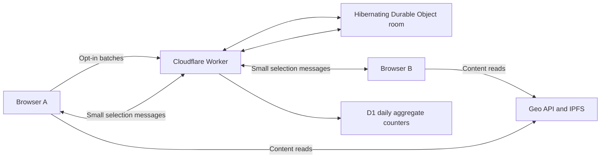

# Shared exploration and usage counts

Geo Companion uses Cloudflare for the small amount of shared state that cannot stay in one browser. Linux-cloud is not in this runtime. Geo remains the content and publication destination.



## Implemented prototype

- **Explore together:** start a room, copy an invitation, join explicitly, share the current view, and choose whether to open the other participant's selection. Maximum two connected browsers; no login required. Education map places and curated posts carry their public Geo space/entity IDs. Other screens currently share their route, not all filters or scroll position. Outreach has no verified service pins yet.
- **Usage counts:** off by default. Consent is saved locally and synchronized across open tabs. Screen visits and education place/post selections are batched at most once per 30 seconds, up to 20 events. Closing the tab can discard unsent events. There is no persistent queue or retry storm.
- **Community activity:** an on-demand aggregate since the UTC date seven days ago, with groups below ten events suppressed. Counts are events, not unique people, votes, endorsements, or evidence of need. Repeated or fabricated events can inflate them. No automatic editorial action or Geo publication follows.

## Data boundaries

`src/shared/coordination/protocol.mjs` allows only known app routes, enumerated actions and valid 32-character Geo IDs. It strips other fields. Telemetry never includes the Geo IDs: only route and action survive. Raw searches, names, followed identities, precise locations, editorial text and media are excluded.

Invitation links put an unguessable 128-bit room capability in the URL fragment. Anyone holding that invitation can occupy a seat; it is not identity verification. A participant explicitly sends each selection. The service does not store selection history or replay a selection to later joiners. No cursor streaming, chat, screen capture or peer network connection is implemented.

Cloudflare necessarily handles connection metadata such as IP addresses. The application does not store those addresses or enable Worker observability logs. “No application-level identity tracking” is more accurate than a promise of network anonymity.

## Runtime and limits

`services/coordination/worker.mjs` routes requests to SQLite-backed Durable Objects (`Room`, `Budget`) and D1 (`METRICS`). Rooms use Cloudflare's WebSocket hibernation API, so idle sockets do not require an always-running VM. Alarm expiration closes the room after one hour and clears its stored expiry. Socket attachments retain only a last-message timestamp and message count while connected.

Each socket permits at most 120 selection messages, no faster than one per second, with a 1 KiB maximum payload. HTTP telemetry bodies are capped at 4 KiB. One daily Budget object admits at most 1,000 application HTTP requests across room creation, joins, events and insights. It updates the counter transactionally. Health checks and preflight requests do not consume that application budget; WebSocket messages have their separate limits. This is an intentionally conservative prototype ceiling shared by all users.

The budget is not DDoS protection or a billing cap: rejected requests still reach Workers, and an attacker can consume the shared allowance. CORS limits cooperating browsers, not arbitrary HTTP clients. Free-tier platform quotas remain the final ceiling. Do not automatically upgrade the plan to recover from exhausted quotas.

D1 holds `(UTC day, route, action, count)` only. A daily scheduled cleanup and successful event writes remove rows older than 30 days. There are no user-level rows to delete after consent is withdrawn; opting out stops future collection. Scheduled cleanup failures can delay removal and should be checked operationally.

## Run locally

```sh
npx wrangler d1 execute geocompanion-metrics --local --config services/coordination/wrangler.jsonc --file services/coordination/schema.sql
npx wrangler dev --config services/coordination/wrangler.jsonc --port 8787 --var ALLOWED_ORIGINS:http://127.0.0.1:5173
node scripts/test-coordination.mjs
```

For browser testing, temporarily set `public/coordination.json` to `{"endpoint":"http://127.0.0.1:8787"}`. Restore the hosted endpoint before a production build. The integration script is deliberately fixed to localhost and must never generate production telemetry. It checks two clients, third-seat rejection, relay, field stripping, invalid-message closure, CORS and real local D1 aggregation.

## Deployment

`node scripts/deploy-coordination.mjs` reads only the Cloudflare token/account from root `.env`, reuses or creates the named D1 database, applies the idempotent schema, deploys the Worker and migrations, verifies health, and updates the frontend endpoint and CSP. It never changes a subscription. Then run the existing Pages build and deployment. No token goes into the frontend.

Required account permissions: Workers Scripts Edit, D1 Edit, Account Settings Read. Existing Pages and DNS scopes remain separate. The deployed endpoint is `https://geocompanion-coordination.thomasfreestone.workers.dev`; allowlisted browsers are the two production Pages/custom-domain origins. Preview origins are deliberately excluded.

Verified on September 12, 2026: Worker and D1 provisioned through Cloudflare, HTTPS health passed. Local runtime tests and the frontend build passed. See DEPLOYMENT.md for frontend release observations; provisioning a backend alone does not demonstrate the UI works.

## Next iterations

- Show more useful coarse unmet-demand categories after defining the taxonomy with the editor; the `empty` action is reserved but not currently emitted. Do not start logging raw searches.
- Synchronize selected dashboard filters or public outreach service IDs once each screen has a validated selection contract.
- Add room revocation, recovery and stronger abuse controls if usage warrants them. Leaving disconnects your socket; it does not revoke the invitation.
- Research Linux embedded in web apps next, as a separate browser experiment. It does not justify adding linux-cloud to this data path.

Current official references: [Workers pricing](https://developers.cloudflare.com/workers/platform/pricing/), [Durable Objects pricing](https://developers.cloudflare.com/durable-objects/platform/pricing/), [WebSocket hibernation](https://developers.cloudflare.com/durable-objects/examples/websocket-hibernation-server/), [D1 pricing](https://developers.cloudflare.com/d1/platform/pricing/). Free quota targets were checked during implementation; account subscription details were not readable with the supplied token, and no paid upgrade was requested or performed.
