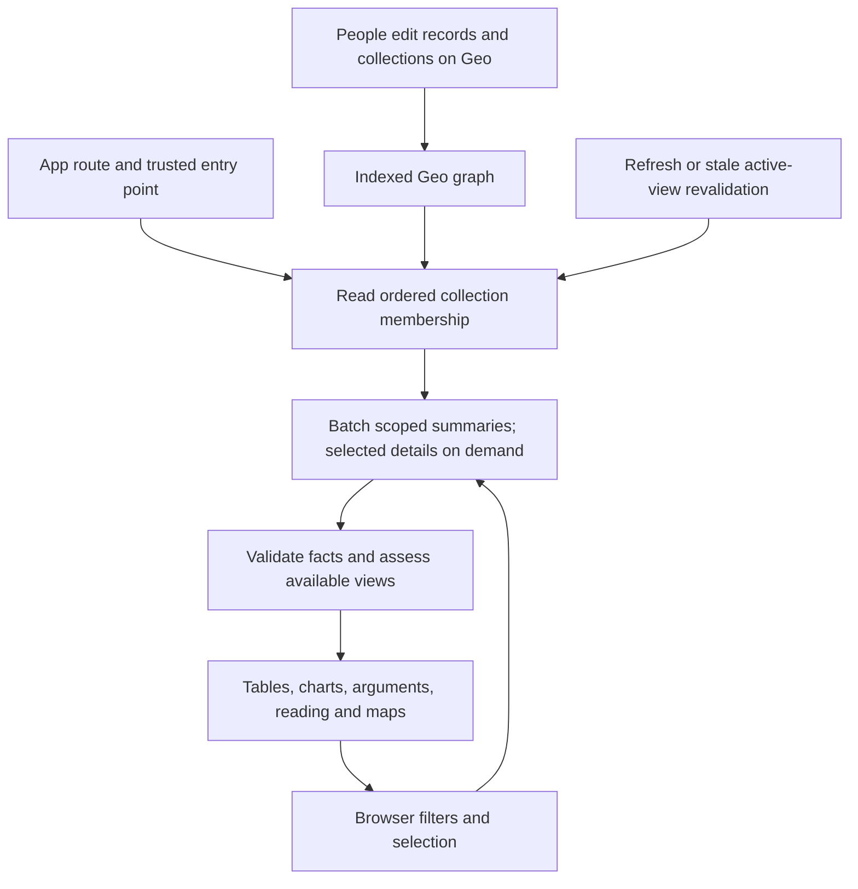

# Design: reading a living Geo graph

Proposed September 12, 2026, following the [hardcoding audit](HARDCODED_CONTENT_AUDIT.md). This is a design, not a deployed change. Editing entities and relationships on Geo is a core product feature; readers must handle changes and removals as ordinary inputs.

Implementation checkpoint: the native Questions reader and initial shared client/collection primitives are now in the local working tree. It retrieved all 21 Questions with names/framing in order and correctly left absent Answers empty. Forty-eight tests and build pass; local browser search, dialog/Escape, direct Geo destinations and dark mobile layout verified. The current complete-collection helper stops at 40 pages; incremental per-action coverage controls and migration of other adapters remain outstanding. No deployment is claimed here.

## Decision

Local verification checkpoint: native catalog now includes the publisher-added teacher-coaching dataset automatically (26 entries). The retired STAR-only implementation and empty public editorial JSON have been removed. Read-response interception in the browser verified membership removal (8→7→8) and edited-unit chart withdrawal with readable results retained. No Geo mutation was used. Dashboard and curation now revalidate on stale visible-tab return. These local checks do not establish deployment or completion of remaining outreach and adapter work.

Use **Geo-owned collections, typed read adapters and browser-derived views**. Geo owns content, membership, order and relationships. Companion owns safe tools for interpreting those records. Cloudflare delivers the interface; browsers read Geo directly. This design needs no Linux service or mirrored content database.

Keep a small local registry of app routes, approved entry points and supported semantic contracts. Do not embed study lists, author prose, service rows or reference-space menus. A compatible record added to a collection must appear without a release. A genuinely new tool or meaning can require code: future-proofing does not mean guessing unfamiliar properties.



## Reuse native collections

Prefer existing Geo pages/datasets with ordered Blocks and collection Data Blocks. Collection item edges supply membership. Maintenance then benefits Geo itself as well as Companion. Initially support explicit collections and existing verified typed discovery queries. Query-backed blocks need a separately verified filter translator; never execute arbitrary remote queries, URLs or serialized filters.

Read-only checks against the configured API on September 12 confirmed:

- Collection item `a99f9ce12ffa4dac8c61f6310d46064a`, Question `4318a1d2c441455cb76544049c45e6cf`, and Answers `73609ae8644c4463a50a90a3ee585746` exist with those resolved names. Existence does not verify every type constraint.
- Publisher model review confirmed that Answers targets Answer type `a4fa26b57a4b41559d5cd571519fe527`, not Claim. Never attach or interpret Claims through Answers automatically. Its subsequent [publication report](../../geo-publisher/docs/original-question-reconciliation.md) records 21 original Questions in dataset `b1f70bc05d4e454dab2448a0e3172195`, block `d19cf5813cf9451d9ef7d793c9b7c9d9`: 138 publication checks and 157 independent consumer checks passed. Traverse Collection item, not Dataset entries, with scoped full pagination and position sorting. Display Name and Description together for context. Answers and other research relationships remain unpopulated pending review. This publication evidence is from the publisher; Companion integration remains pending.
- STAR dataset `9220554acfd249a18920b301dcbb6cf0` contains an ordered block named “Achievement effects by grade and assigned class condition,” ID `8de2afc87d99401b99c6db5e8d25460b`. It uses Collection item edges and Collection data-source ID `1295037a5d9c4d09b27c5502654b9177`. The bounded inspection returned an incomplete item page; the actual reader must paginate it.

This is concrete evidence that native membership can replace STAR-specific result selection. The publisher's [constants](https://github.com/athsrueas-geocurator/geo_publisher/blob/main/src/constants.ts) and [dashboard contract](https://github.com/athsrueas-geocurator/geo_publisher/blob/main/docs/education-dashboard-data-contract.md) provide reference implementations. Verify each collection's scoped edges. Do not assume every dataset uses this layout or that a landing collection already exists.

## Screen contracts

| Screen | Geo supplies | Companion computes or controls |
| --- | --- | --- |
| App selector | Primary-space avatar; optional explicit app-collection name/description | Registered app routes, safe navigation, triangle fallback |
| Dashboards | Dataset catalog, ordered result collections, estimates, dimensions, source/study links and interpretation blocks | Dataset picker, typed table, compatible chart, filters derived from actual dimension IDs |
| Atlas | Scoped programs/studies, membership, topics and sources | Search/grouping; distinguish program, study, report and result |
| Questions | Native Questions, Answers, Topics and Sources after contract verification | Question/answer view; linked Claims open argument tools without conflating the types |
| Arguments | Explicit supporting/opposing/related edges and relevant topic/source neighborhoods | Preserve direction and meaning; bounded traversal; separate response counts |
| Curation | Editor-owned ordered/featured Post collection, ordered Blocks and references | Exact authored text, saved selection and reading tools; no generated editorial copy |
| Connections | Active app contexts, supported relationships and target memberships | Group shared identities while retaining asserting spaces and edge roles |
| Education map | Selected dataset/study location relations and verified coordinates | Group places; distinguish study area, institution and exact site |
| Outreach | Exact directory membership, services, schedules, eligibility and public locations | One normalized model powers directory, map, weekly, food and coordination views |

Collections define membership, not truth or endorsement. A followed profile does not replace the site editor. A linked space does not make all its content relevant. Outreach needs exact directory membership, never just a space-wide query.

## Identity and context

Use entity IDs for identity and selection; names are editable display data. Collection positions supply editorial order. Relation IDs distinguish edges, including different roles pointing to the same target.

Normalize assertions with endpoint/network, asserting space, entity ID, property ID, value and observation time. Keep edges with their ID, space, source, type, target and position. These are internal types, not proposed Geo properties. Never flatten conflicting cross-space assertions into one canonical value.

Resolve reference destinations from verified membership and the context supplying the displayed content. Prefer a validated explicit target context when supplied; retain the current context when valid. When multiple contexts are equally plausible, offer their live names on demand rather than arbitrarily selecting the first. An unverified destination remains an unavailable reference, not a fabricated URL.

Known property IDs retain their semantics even when renamed. New properties are not interchangeable merely because their names resemble old ones. Unknown optional fields can be ignored; unknown required semantics disable only the dependent tool. Do not automatically equate `Is factual=false` with the native Question type.

## Edits are normal

| Geo change | Reader behavior after revalidation |
| --- | --- |
| Rename or rewrite | Replace labels/text under the same ID; retain selection |
| Add or reorder collection items | Read membership/position again; new compatible records appear |
| Remove an item | Remove it from the collection view; cached details must not restore membership |
| Delete or make a selected entity unavailable | Disable dependent actions, show a concise unavailable state and retain navigation back |
| Change an edge's target/type/direction | Replace refreshed edges and recompute roles; do not union new edges with deleted old ones |
| Change unit, study, comparator or interpretation | Reassess compatibility; withhold invalid chart points while preserving readable details |
| Remove a required value | Treat it as unknown, not zero/false or the old cached value |
| Add an unfamiliar field/type | Render supported fields/links; no guessed conversion or executable remote configuration |
| Supply conflicting values | Preserve the conflict; withhold the affected scalar/calculation, not unrelated records |
| Break a block/source reference | Keep valid sections readable and identify the unavailable section |
| Change service hours or location visibility | Recompute schedule/map eligibility; suppress locations no longer verified public |

Distinguish a failed request from successful absence. A timeout is not deletion. Successful absence must not be hidden by stale cached data. Record-level validation should isolate malformed records rather than fail an otherwise useful collection; missing required pagination can still make a calculation incomplete.

## Refresh replaces; pagination continues

Assign a generation to each refresh and a cursor chain to each collection read. Deduplicate pages within a generation and reject repeated cursors. A fresh generation starts a new membership set. Late responses from an older generation cannot restore removed data.

Stage a bounded complete refresh and swap membership when finished. If a collection exceeds the action budget, show the newly loaded partial set with Load more. Do not present unseen old pages as confirmed membership. Reset cursors on refresh; filters/counts concern loaded records while more pages remain. Never crawl the whole graph merely to compute a total.

No snapshot-consistent pagination, subscription, ETag or revision synchronization mechanism has been verified for these reads. A multi-page result can cross an edit. Detect duplicate/repeated cursor anomalies and revalidate affected selections; do not claim atomic snapshots. Investigate Geo revision/history capabilities separately before using them for synchronization. Start with bounded re-reads, not per-browser blockchain polling.

## Render according to available facts

Each normalized record yields supported view capabilities and reasons other tools are unavailable. A compact table/detail reader is the baseline. A forest plot, economic-scenario table, argument view or map is an enhancement with explicit requirements.

Numerical compatibility includes study/cohort, instrument/outcome, unit/normalization, estimand, comparator, follow-up and uncertainty semantics. Economic views also need currency, price year, denominator, perspective, period and explicit cost/outcome links. Missing dimensions mean unknown compatibility. A matching unit label alone is insufficient. Keep models separate from observations, alternate estimates separate from independent results, and multiple outcomes separate from independent studies.

Chart axes derive from eligible visible values/intervals; series names come from linked concepts. Mathematics and accessible layout stay in code. Do not interpret an arbitrary number as a standard error or invent a conclusion. Preserve source-supported context with optional methodology.

Outreach has stricter gates: exact membership, verified public service location, service rather than office hours, timezone, recurrence, date ranges and exceptions. “Scheduled at this time” does not establish current capacity. Store/query/cache only public contact-source links, never contact names or direct contact details. Avoid broad unfiltered entity prose reads in outreach. Old or uncertain schedule/location data must not support “help available now.”

## Query and cache implementation

Build a small shared lifecycle client, not a universal graph crawler. Domain queries and semantic validators remain in feature adapters.

```text
src/shared/geo/client.mjs          timeouts, concurrency, errors, shared requests
src/shared/geo/query-cache.mjs     scoped keys, expiry, invalidation, generations
src/shared/geo/collections.mjs     supported ordered collections and coverage
src/shared/geo/references.mjs      verified target contexts and safe links
src/config/app-sources.ts         routes, trusted entry points, supported adapters
src/apps/education/study-data.mjs result normalization and capabilities
src/apps/outreach/service-data.mjs contact-free service/schedule normalization
```

Initial budgets below are design choices to measure, not verified Geo limits:

- Four concurrent Geo reads per tab, coalescing identical requests. One subscriber cannot cancel a shared request still needed elsewhere.
- Twenty-five summaries per page; up to four pages per user load action, then Load more. Batch detail targets up to 50 IDs, and paginate required nested connections separately.
- Query exact relevant properties/edges. Lists omit Markdown, argument neighborhoods, photos and unused coordinates. Load selected details in batches rather than one request per row.
- Shared memory cache target: 128 parsed entries and approximately 4 MiB estimated serialized data, with least-recently-used eviction. Oversized details may render transiently without cache admission. Measure actual responses in development, not in visitor-facing diagnostics.
- Keys include endpoint/network, adapter version, context/space, collection, query/projection, filters, selected IDs and cursor. Cache validated successes only. This design covers public reads.
- Track dependencies: membership changes invalidate derived lists/counts; refreshed entities/edges invalidate affected views and references. Local filtering over loaded fields does not fetch.

| Data | Proposed freshness | Refresh trigger |
| --- | --- | --- |
| Collection membership and summaries | 2 minutes | Open/revisit or visible-tab return when stale; manual refresh immediately |
| Selected detail and editorial text | 2 minutes | Selection/focus when stale; refresh includes needed blocks/edges |
| Concept/space names and avatars | 30 minutes | On use when stale; explicit detail refresh includes visible referenced labels |
| Active outreach schedule records | 1 minute | On use/focus; published fact-verification age remains a separate gate |
| Optional response counts | 1 minute | Only while the corresponding panel is used |

Initially no interval polling. A continuously visible tab may stay unchanged until refresh/revisit: bounded freshness, not instant streaming. If continuous updates become necessary, measure a visibility-aware active-view interval before adding it. Hidden tabs and unused routes perform no periodic reads.

Ordinary reading may show cached content while revalidating, but successful removals/deletions replace it. Failed refreshes get an actionable update error. Stale or failed outreach refreshes cannot substantiate current availability, and old location permissions cannot resurrect pins. Editorial content remains memory-only. Keep existing education map persistence isolated during migration; do not generalize it to canonical writing. Offline outreach remains a separate explicit expiry/consent feature.

## Publisher handoff requirements

Inventory existing structures before creating or republishing anything:

1. Education catalog and ordered dataset/result collections: IDs, asserting spaces and complete cursor queries. Reuse native collection membership instead of a duplicate companion-only study list.
2. Result-family dimensions, study/source identities and interpretation blocks, with a precise missing-field list. Existing valid rows do not need republishing to fit a generic chart.
3. Native Question/Answers contract after original-question identity review, distinct from debate Claims.
4. Editor-owned featured/ordered Posts using only personally selected material. Without an approved order, keep the existing explicitly selected post or a neutral picker; invent no editorial priorities.
5. Exact outreach membership and a small verified, contact-free service cohort with schedules/public locations in the approved space.

Supply representative API responses, indexing/publication evidence and missing/changed-record examples. This design needs no new space; creating another space still requires approval. Content IDs are collection data; type/property meaning is a versioned adapter contract.

## Delivery order and verification

1. **Collection proof:** read STAR through its existing collection block, retrieve grade/arm names, and reproduce the eight-row chart without a fixed grade/arm list. Use fixtures for rename/removal tests; do not mutate Geo merely to test.
2. **Second family:** discover another existing dataset, render its generic detail/table, then enable only supported charts. Verify an incompatible pair is readable without a combined ranking. Confirm an existing entry collection or agree one with the publisher.
3. **Freshness and references:** move proven adapters onto the shared lifecycle/cache and resolver; test stale races and cross-space assertions. Migrate incrementally.
4. **Questions and curation:** integrate verified native questions and editor-owned collections, preserving exact writing and explicit argument semantics.
5. **Outreach:** implement one normalized adapter and derive its five views. Test hours, exceptions, deletions and withheld locations before availability claims.
6. **Connections and cleanup:** use the same active collection contexts; retire obsolete discovery assumptions and unused editorial artifacts.

Required mutation fixtures: rename, reorder, remove/re-add, broken reference, deleted selection, changed unit/edge role, conflicting scoped values, unknown type, partial pagination and late stale responses. Also verify selection retention, mobile/dark rendering, no cross-app contamination, bounded repeat reads and direct browser destinations. Tests must exercise real contract behavior, not mirror prose.

Success: changing supported Geo content or membership updates the appropriate screen after revalidation without rebuilding. Unsupported new semantics remain readable where possible and request an adapter extension rather than silently producing the wrong visualization.
